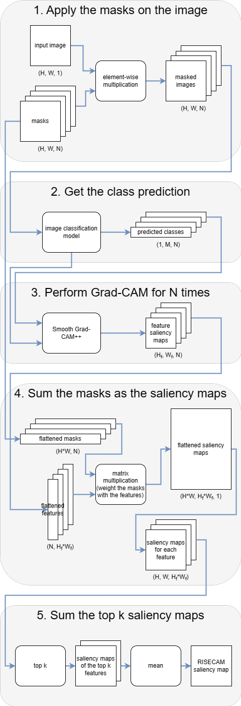
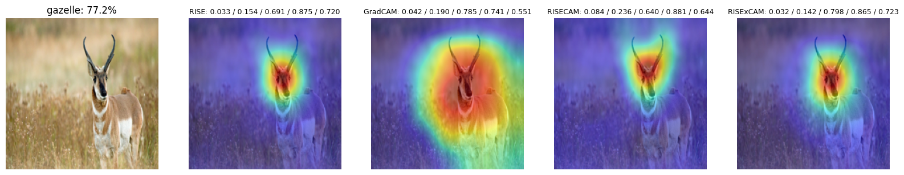

# RISE-CAM: Explainable AI for Image Classification
This repository contains source code necessary to reproduce the main results in this project:


## Method overview
This repository introduces two novel algorithms--RISE-CAM and RISExCAM. These algorithms are merge from two classic XAI algorithms, RISE and Grad-CAM. Below is the flow chart of how RISE-CAM works.


## Repository contents
1. Introduction_RISECAM.ipynb is a brief tour to go through the mechanisms of RISE and Grad-CAM, and how RISE-CAM was developed based on them. This notebook demonstrates the outputs of each algorithms.
2. Evaluation_RISECAM.ipynb provides a thorough comparison of RISE, Grad-CAM, RISE-CAM, and RISExCAM. The there are different evaluation metrics used here. This file is too large to be previewed on GitHub.
3. Evaluation_RISECAM_lite.ipynb is a notebook without the output saliency maps and with a smaller file size. Thus, it can be previewed.
4. Most of the functions used in this project can be found in algorithms.py.
## Before you start...
Install the required packages.
```shell
pip install -r requirements.txt
```
The images in the "examples" folder serve the prupose of simple demonstration. To perform a complete evaluation, please download the dataset from:

https://www.kaggle.com/datasets/iamsouravbanerjee/animal-image-dataset-90-different-animals

Remember to unzip the folder under this directory before running Evaluation_RISECAM.ipynb.
## Examples
